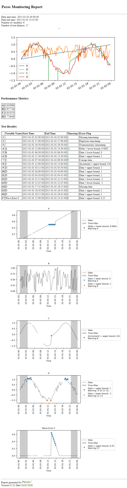

.. _simple_example:

Simple example
================

A simple example is included in the `examples/simple <https://github.com/sandialabs/pecos/tree/master/examples/simple>`_ directory.  
This example uses data from a CSV file, **simple.csv**, which 
contains 4 columns of data (A through D). 

* A = elapsed time in days

* B = uniform random number between 0 and 1

* C = sin(10*A)

* D = C+(B-0.5)/2

The data includes 
missing timestamps, 
duplicate timestamps, non-monotonic timestamps, corrupt data, data out 
of expected range, data that doesn't change, and data that changes abruptly, as listed below.

* Missing timestamp at 5:00 

* Duplicate timestamp 17:00

* Non-monotonic timestamp 19:30

* Column A has the same value (0.5) from 12:00 until 14:30

* Column B is below the expected lower bound of 0 at 6:30 and above the expected upper bound of 1 at 15:30

* Column C has corrupt data (-999) between 7:30 and 9:30

* Column C does not follow the expected sine function from 13:00 until 16:15.  The change is abrupt and gradually corrected.

* Column D is missing data from 17:45 until 18:15

* Column D is occasionally below the expected lower bound of -1 around midday (2 time steps) and above the expected upper bound of 1 in the early morning and late evening (10 time steps).

The script, **simple_example.py** (shown below), is used to run quality control analysis using Pecos.
The script performs the following steps:

* Load time series data from a CSV file

* Run quality control tests

* Save test results to a CSV files

* Generate an HTML report

.. literalinclude:: ../examples/simple/simple_example.py

Results include:

* HTML monitoring report, **monitoring_report.html** (:numref:`fig-monitor-1`), includes quality control index, summary table, and graphics

* Test results CSV file, **test_results.csv**, includes information from the summary tables

.. _fig-monitor-1:

   
   Example monitoring report.