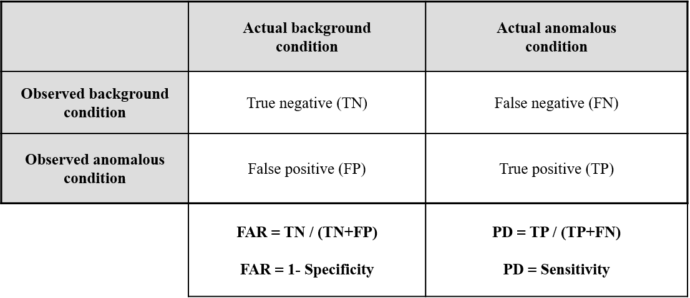
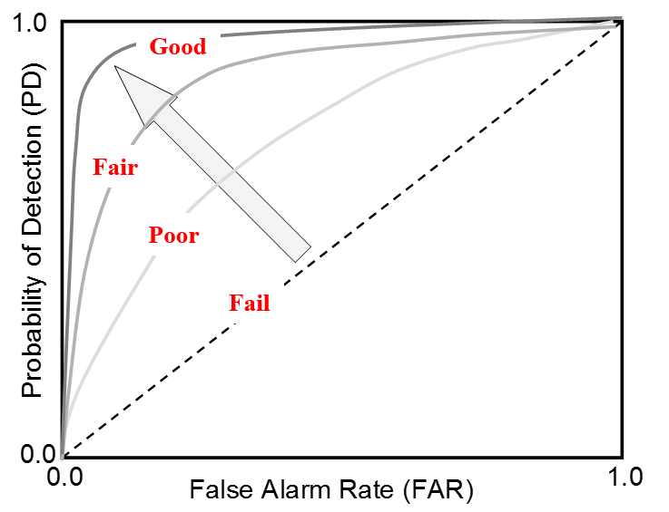

Metrics
==========================

Pecos includes several metrics that describe the quality control analysis or 
compute quantities that might be of use in the analysis. 
Many of these metrics aggregates over time and can be saved to track long 
term performance and system health.

While Pecos typically runs a series of quality control tests on raw data, quality control tests can also be run on metrics generated from these analyses to track long term performance and system health.  For example, daily quality control analysis can generate summary metrics that can later be used to generate a yearly summary report.
Pecos includes a performance metrics example (based on one year of PV metrics)
in the `examples/metrics <https://github.com/sandialabs/pecos/tree/master/examples/metrics>`_ directory.

Quality control index
-------------------------
The quality control index (QCI) is a general metric which indicates the 
percent of data points that pass quality control tests.  
Duplicate and non-monotonic indexes are not counted as failed tests 
(duplicates are removed and non-monotonic indexes are reordered).  
A value of 1 indicates that all data passed all tests.  
QCI is computed for each column of data.                                 
For example, if the data contains 720 entries and 
700 pass all quality control tests, then the QCI is 700/720 = 0.972.
QCI is computed using the :class:`~pecos.metrics.qci` method.

To compute QCI,

.. doctest::
    :hide:

    >>> import pandas as pd
    >>> import numpy as np
    >>> import pecos
    >>> pm = pecos.monitoring.PerformanceMonitoring()
    >>> index = pd.date_range('1/1/2017', periods=24, freq='H')
    >>> data = {'A': np.arange(24)}
    >>> df = pd.DataFrame(data, index=index)
    >>> pm.add_dataframe(df)
	
.. doctest::

    >>> QCI = pecos.metrics.qci(pm.mask)

Root mean square error
-------------------------

The root mean squared error (RMSE) is used to compare the 
difference between two variables.  
RMSE is computed for each column of data (note, the column names in the two data sets must be equal).
This metric is often used to compare measured to modeled data.
RMSE is computed using the :class:`~pecos.metrics.rmse` method.
	
Time integral
-------------------------

The integral is computed using the trapezoidal rule and is computed using 
the :class:`~pecos.metrics.time_integral` method.
The integral is computed for each column of data.

Time derivative
-------------------------

The derivative is computed using central differences and is computed using 
the :class:`~pecos.metrics.time_derivative` method.
The derivative is computed for each column of data.              

Probability of detection and false alarm rate 
-------------------------------------------------

The probability of detection (PD) and false alarm rate (FAR) are used to
evaluate how well a quality control test (or set of quality control tests) 
distinguishes background from anomalous conditions.
PD and FAR are related to the number of true negatives, false negatives, false 
positives, and true positives, as shown in :numref:`fig-FAR-PD`.
The estimated condition can be computed using results from quality control tests in 
Pecos, the actual condition must be supplied by the user.
If actual conditions are not known, anomalous conditions can be superimposed 
in the raw data to generate a testing data set.
A "good" quality control test (or tests) result in a PD close to 1 and FAR close to 0.

Receiver Operating Characteristic (ROC) curves are used to compare the 
effectiveness of different quality control tests, as shown in :numref:`fig-ROC`.
To generate a ROC curve, quality control test input parameters (i.e. upper 
bound for a range test) are systematically adjusted.
PD and FAR are computed using the :class:`~pecos.metrics.probability_of_detection` 
and :class:`~pecos.metrics.false_alarm_rate` methods.
These metrics are computed for each column of data.

.. _fig-FAR-PD:

   
   Relationship between FAR and PD.
 
.. _fig-ROC:

   
   Example ROC curve.

